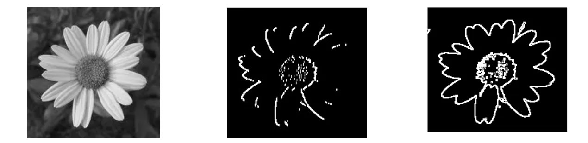
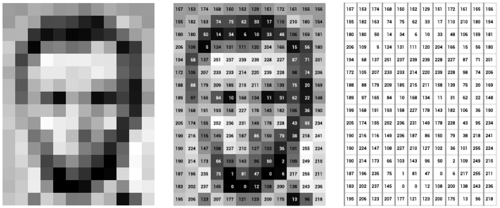

# Image Edge Detection Filter

A C++ implementation of an edge detection filter using a Laplacian kernel to detect edges in grayscale images. This project applies convolution operations and normalizes the output so you can actually see the edges clearly.

## Features

- **Edge Detection**: Applies a 3x3 Laplacian kernel to detect edges in images
- **Min-Max Normalization**: Scales output values to the standard 0-255 grayscale range
- **Image Visualization**: Prints images in a formatted, readable manner

## How It Works

### 1. Edge Detection Kernel

The program uses a Laplacian kernel for edge detection:
```
-1  -1  -1
-1   8  -1
-1  -1  -1
```

This kernel highlights regions where the image intensity changes rapidly (aka edges) by computing the second derivative.

### 2. Convolution Process

For each pixel (except the borders), the kernel is applied by:
- Multiplying each neighboring pixel by the corresponding kernel value
- Summing all the products
- Storing the result in the output image

### 3. Normalization

The raw edge detection output gets normalized to 0-255 using min-max normalization:
```
normalized_value = ((value - min) × (255 - 0)) / (max - min) + 0
```

This makes sure the output is visible as a standard grayscale image.

## Visual Examples

### Example 1: Flower Edge Detection



*From left to right: Original image, edge detection applied, normalized output*

### Lincoln Example



*Edge detection applied to a portrait, showing the raw values and normalized output*

</div>

### Example 2: Numerical Example
```
Original Image:
50      50      50      50      50      200     200     200     200     200
50      50      50      50      50      200     200     200     200     200
50      50      50      50      50      200     200     200     200     200
50      50      50      50      50      200     200     200     200     200
50      50      50      50      50      200     200     200     200     200  

Edge Detection Filter Applied Image:
0       0       0       0       0       0       0       0       0       0
0       0       0       0       -450    450     0       0       0       0
0       0       0       0       -450    450     0       0       0       0
0       0       0       0       -450    450     0       0       0       0
0       0       0       0       0       0       0       0       0       0

Normalized Output Image:
127     127     127     127     127     127     127     127     127     127
127     127     127     127     0       255     127     127     127     127
127     127     127     127     0       255     127     127     127     127
127     127     127     127     0       255     127     127     127     127
127     127     127     127     127     127     127     127     127     127
```

## Usage

### Basic Example
```cpp
#include "code.h"

int main()
{
    // Define your input image
    vector<vector<int>> image = {
        {100, 200, 300, 400, 500},
        {50, 150, 250, 350, 450},
        {175, 275, 375, 475, 575},
        {0, 100, 200, 300, 400},
        {50, 150, 250, 350, 450}
    };
    
    // Apply edge detection
    vector<vector<int>> edges = applyKernel(image);
    
    // Normalize the output
    vector<vector<int>> normalizedEdges = minMaxNormalization(edges);
    
    // Display the result
    printImage(normalizedEdges);
    
    return 0;
}
```
## Notes

- **Data Structure**: Images are represented as `vector<vector<int>>` (2D vectors)
- **Pixel Range**: Input values should be in the range 0-255 for standard grayscale images
- **Border Handling**: Edge pixels are set to 0 (1-pixel border) since the 3x3 kernel can't be fully applied at the edges
- **Edge Cases**: If all pixels have the same value, normalization returns an all-zero image
